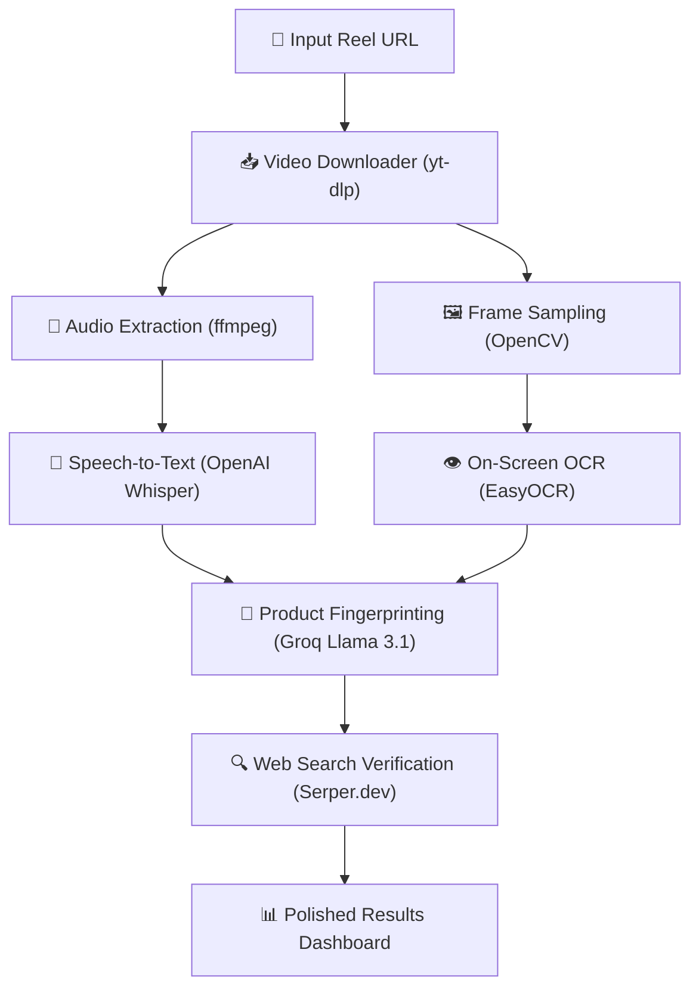

# ReelAI — Social Media Reel Product Identifier

ReelAI is an AI-powered social media reel analyzer. Paste a video URL (Instagram Reels, YouTube Shorts, or TikTok), and ReelAI will automatically extract the video, analyze its contents, and output a structured profile identifying the exact product being promoted, complete with official web search candidates for purchasing or verification.

---

## 👁️ What ReelAI Does

When you watch a short-form video (Reel/Short/TikTok), it often showcases a product without a direct link, or uses brand keywords in the background. ReelAI runs a multi-stage automated pipeline to reconstruct the product profile:



### The 5-Step Pipeline

1. **Download & Extract (yt-dlp + ffmpeg)**: The video is downloaded to a temporary directory. The audio track is isolated, converted to mono 16kHz WAV format, and prepared for processing.
2. **Audio Transcription (OpenAI Whisper)**: The WAV audio is processed locally using OpenAI's Whisper model to produce a complete text transcript of what is spoken.
3. **Visual OCR (OpenCV + EasyOCR)**: Frames are extracted every 2 seconds from the video. EasyOCR reads all text overlays, captions, and text on products seen on screen.
4. **AI Fingerprinting (Groq Llama 3.1)**: The combined speech transcript and visual texts are packaged into a prompt. Groq compiles a structured JSON fingerprint detailing:
   - **Product Name** & **Brand**
   - **Core Mechanism** (how it works)
   - **Category** / **Business Model** (SaaS, physical product, subscription)
   - **Export Targets** (e.g. Lovable, Cursor, V0)
   - **Distinctive Visual Clues** (colors, labels, UI elements)
5. **Web Search & Verification (Serper.dev)**: ReelAI automatically constructs a Google search query from the fingerprint, fetches organic search results via Serper.dev, and lists candidate links where the product can be bought or verified.

---

## 💻 Tech Stack

- **Frontend**: Single-Page App (SPA) built with modern Vanilla HTML5, CSS3 (featuring glassmorphism, responsive grid layouts, animations), and JavaScript.
- **Backend API**: FastAPI (Python 3.11) with Uvicorn.
- **Machine Learning / Local AI**:
  - `openai-whisper` for speech transcription.
  - `easyocr` + `opencv-python` for video frame text reading.
- **Cloud LLM**: `groq` (Llama 3.1 8B Instant) for structured JSON synthesis.
- **Web Search**: `Serper.dev` (Google Search API).
- **Video Extraction**: `yt-dlp` and `ffmpeg`.

---

## 🚀 Quick Start

### Prerequisites

- **Python 3.11+**
- **ffmpeg** installed on your system and added to your environment `PATH`.
- API keys:
  - [Groq API Key](https://console.groq.com) (Free, high-speed LLM inference)
  - [Serper API Key](https://serper.dev) (Free 100 Google searches/month)

### Local Installation

1. **Clone the repository** and navigate to the backend:
   ```bash
   cd backend
   ```

2. **Create a virtual environment** and install dependencies:
   ```bash
   python -m venv venv
   # On Windows:
   venv\Scripts\activate
   # On macOS/Linux:
   source venv/bin/activate

   pip install -r requirements.txt
   ```

3. **Configure Environment Variables**:
   Create a `.env` file in the `backend/` directory (you can copy `.env.example` as a template):
   ```env
   GROQ_API_KEY=your_groq_api_key_here
   SERPER_API_KEY=your_serper_api_key_here
   ```

4. **Start the server**:
   ```bash
   uvicorn app.main:app --reload
   ```

5. Open your browser to **`http://localhost:8000/`** to view the polished ReelAI Web UI!
   - Interactive API documentation is available at `http://localhost:8000/docs`.

---

## 🐳 Running with Docker

ReelAI includes a production-ready multi-stage Docker build:

1. Create a `.env` file in the `backend/` directory with your API keys.
2. Run Docker Compose:
   ```bash
   docker compose up --build
   ```
3. Open `http://localhost:8000/` in your browser.

---

## 📂 Project Structure

```
backend/
├── app/
│   ├── __init__.py
│   ├── main.py              # FastAPI app setup & UI server route
│   ├── config.py            # Centralized settings & environment variables
│   ├── static/
│   │   └── index.html       # Polished Single Page Application web UI
│   ├── routes/
│   │   ├── __init__.py
│   │   └── analyze.py       # POST /analyze pipeline runner
│   └── services/
│       ├── __init__.py
│       ├── extractor.py     # Video download and audio extraction
│       ├── frame_extractor.py # Frame sampling
│       ├── ocr.py           # On-screen text extraction
│       ├── intelligence.py  # Groq LLM integration
│       ├── retriever.py     # Serper search query builder & retriever
│       └── vision.py        # Frame processing coordinator
├── Dockerfile               # Production container definition
├── docker-compose.yml       # Dev orchestration
├── requirements.txt         # Core Python packages
└── .env.example             # Configuration reference template
```

---

## 📜 License

MIT License. Feel free to modify and deploy.
